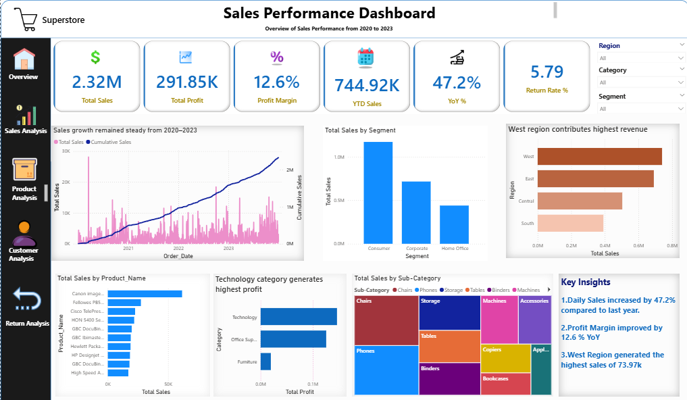
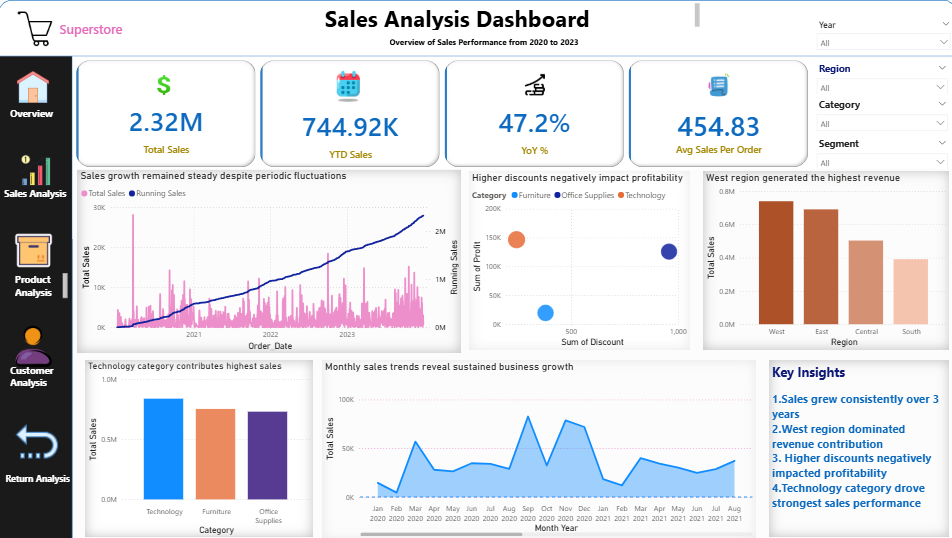
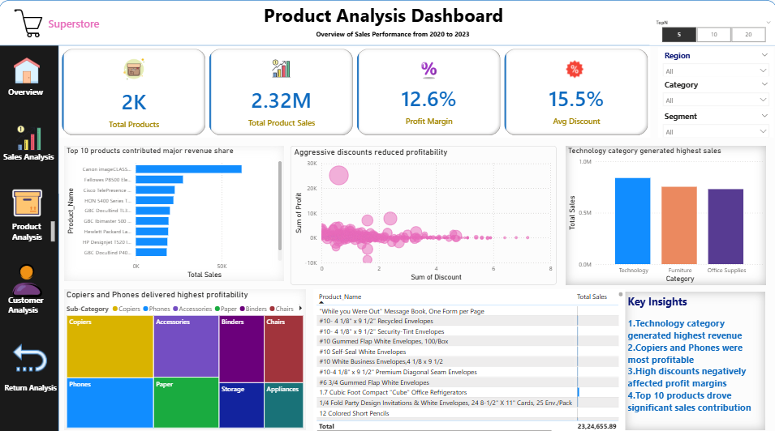
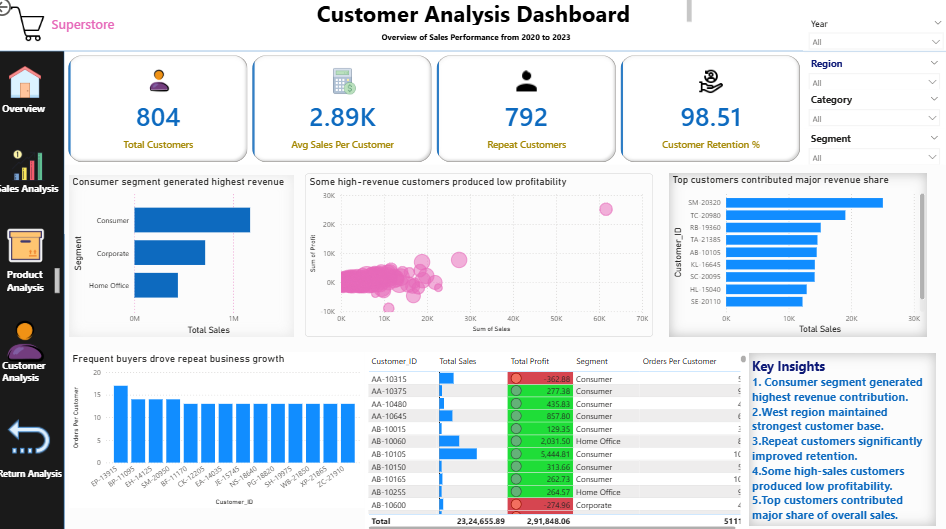
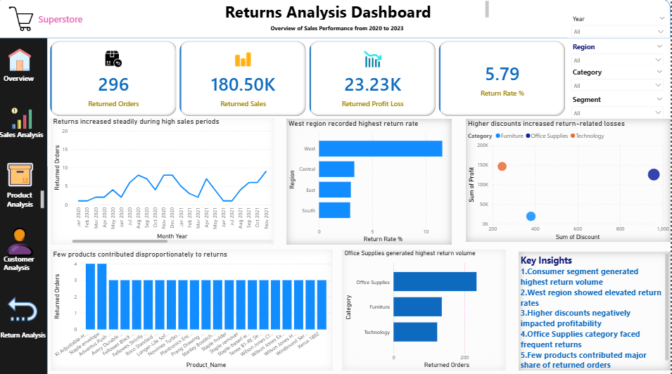

# Retail-Sales-Analytics-PowerBI
# Retail Sales Analytics Dashboard – Power BI

## 📌 Project Overview
This project is an end-to-end Power BI dashboard built using Superstore retail sales data.

The dashboard analyzes:
- Sales performance
- Product profitability
- Customer behavior
- Return analysis
- Business KPIs

The goal of this project is to derive business insights and create interactive dashboards for decision-making.

---

## 🛠 Tools & Technologies Used
- Power BI
- Power Query
- DAX
- Excel

---

## 📊 Dashboard Pages

### 1️⃣ Executive Overview
- KPI cards
- Revenue trends
- Regional sales analysis
- Business summary insights

### 2️⃣ Sales Analysis
- Monthly sales trends
- Running total analysis
- YoY growth analysis
- Regional performance

### 3️⃣ Product Analysis
- Top-selling products
- Profitability analysis
- Discount impact analysis
- Dynamic TopN filtering

### 4️⃣ Customer Analysis
- Customer segmentation
- Repeat customer analysis
- Customer profitability
- Sales contribution analysis

### 5️⃣ Returns Analysis
- Return rate analysis
- Returned products
- Profit loss due to returns
- Return trends by category and region

---

## 📈 Key Business Insights
- Technology category generated highest revenue
- Higher discounts negatively impacted profitability
- Consumer segment contributed largest sales share
- Return rate was approximately 5.79%
- West region generated strongest sales performance

---

## 🧠 Skills Demonstrated
- Data Cleaning & Transformation
- Data Modeling
- DAX Measures
- Time Intelligence
- KPI Development
- Interactive Dashboard Design
- Business Storytelling
- Conditional Formatting
- Dynamic TopN Analysis

---

## 📷 Dashboard Screenshots

### Executive Overview

### Sales Analysis

### Product Analysis

### Customer Analysis

### Returns Analysis

---

## 🚀 Project Outcome
This project demonstrates the use of Power BI for business intelligence and analytics reporting using real-world retail data.
